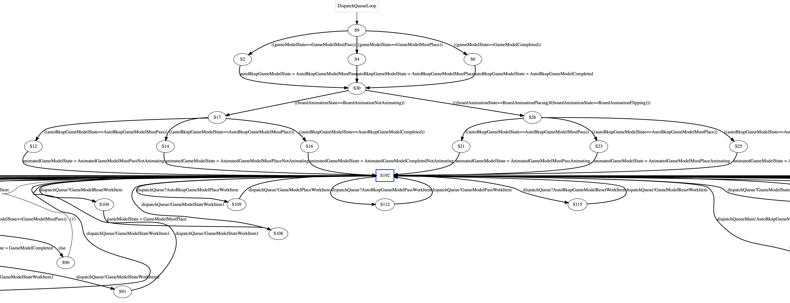

長らくテストとテスト容易設計を生業としてきましたが、最近は色々な限界を感じて形式手法に取り組んでいます。

この記事では、**既存の自動テストのどこに限界を感じてなぜ形式手法が必要なのか**の私見を説明します。なお、私もまだ完全理解には程遠いため間違い等あるかもしれません。もし間違いを見つけられたらぜひ [Kuniwak](https://twitter.com/orga_chem) まで教えていただけると助かります。


# お前誰よ

とあるテストマンです（[経歴](https://gist.github.com/Kuniwak/0d203a08dfe49220f5aaac65cf7e1745)）。最近はギョームで形式手法をやっています（他にも色々やっている）。


# 自動テストの限界
## 自動テストとは

私がここ数年悩んでいたことは、iOS や Web アプリなどのモデル層のバグを従来の自動テストで見つけられないことでした。ここでいう自動テストとは以下のようにテスト対象を実際に実行して結果を確認する方法を意図しています：

```javascript
// 自分で実装した add（と equals）で 1+1 が 2 になるかを検証する自動テスト。
describe('add', () => {
  context('when given 1 and 1', () => {
    it('should return 2', () => {
      const actual = add(ONE, ONE);

      const expected = TWO;
      assert(equals(actual, expected));
    });
  });
});
```

この例では自分で実装した `add` 関数の挙動を確認するために `equals(add(ONE, ONE), TWO)` の結果を検証しています。
ただ、足し算の動作確認として 1 + 1 だけを確認しても安心はできないですから、これに加えて別のテストケースを足していくことになります。

なあ、先に今回の話の前半のポイントを提示しておくと、このように**「テストケースの追加」を続けていくとどのように考え方を変えなければならないか**ということです。


## テストケース増加への対応の限界

さて、1+1 以外のテストケースとして `add(1, 0) == 1` を検証しようとすると、次のように同じような単純なテストケース（[Single Condition Test](http://xunitpatterns.com/Principles%20of%20Test%20Automation.html)）を増やすことになるでしょう：

```javascript
describe('add', () => {
  context('when given 1 and 1', () => {
    it('should return 2', () => {
      const actual = add(ONE, ONE);

      const expected = TWO;
      assert(equals(actual, expected));
    });
  });

  // 別の入力を試したいならテストケースを分ける。
  context('when given 1 and 0', () => {
    it('should return 2', () => {
      const actual = add(ONE, ZERO);

      const expected = ONE;
      assert(equals(actual, expected));
    });
  });
});
```

<dl>
<dt>ここまでの流れ
<dd>単条件のテストケース追加
</dl>

これも悪くないですが、1つのテストケースを足すたびに8行ほどの記述が必要なのは少し辛いですね[^1]。そこで、この例のように複数のテストケースが入力値だけ異なるとき次のような共通化を図ります（[Parameterized Test](http://xunitpatterns.com/Parameterized%20Test.html)やTable Driven Testと呼ばれます）：

```javascript
describe('add', () => {
  [
    {lhs: ONE, rhs: ONE, expected: TWO },
    {lhs: ONE, rhs: ZERO, expected: ONE },
  ].forEach(({lhs, rhs, expected}) => {
    context(`(${lhs}, ${rhs})`, () => {
      it(`should return ${expected}`, () => {
        const actual = add(lhs, rhs);

        assert(equals(actual, expected));
      });
    });
  });
});
```

こうすると、新たなテストケースを足すのに必要な行数はたったの1行となり保守が楽になります。ここまでは自動テストでも余裕で対応できます。

<dl>
<dt>ここまでの流れ
<dd>単条件のテストケース追加 → Parameterized Test
</dl>

ところで、今回のテスト対象である足し算をきちんと実装できたと安心できるテストケースの数はどれぐらいでしょうか？少なくとも今回試した2つだけでは安心できないはずです。このようなときにテストマンがよく使う手法は「**同値分割**」と「**境界値分析**」です。これらはいずれも試さないといけない入力が大量にある状況を現実的な時間で対処するために入力を間引くための方法です。同値分割は出力が同じになる入力から代表値を選ぶという方法で入力を間引きますし、境界値分析では内部の条件分岐のちょうど境目付近を通過する入力はなるべく間引かない方法とも言い換えられるでしょう。

今回は厳密な同値分割はせず、ざっくり小さい値と大きな値から代表値をテストケースに加えるとしましょう。ついでに境界値になりそうな 0 も入れておきます：

```
describe('add', () => {
  [
    {lhs: ONE, rhs: ONE, expected: TWO }, // 小さい値と小さい値の組み合わせ
    {lhs: ONE, rhs: ZERO, expected: ONE },
    {lhs: ONE_MILLION, rhs: ONE, expected: ONE_MILLION_ONE }, // 大きい値と小さい値の組み合わせ
    {lhs: ONE, rhs: ONE_MILLION, expected: ONE_MILLION_ONE }, // 小さい値と大きい値の組み合わせ
    {lhs: ZERO, rhs: ZERO, expected: ZERO }, // 境界値になりそうな値
  ].forEach(({lhs, rhs, expected}) => {
    context(`(${lhs}, ${rhs})`, () => {
      it(`should return ${expected}`, () => {
        const actual = add(lhs, rhs);

        assert(equals(actual, expected));
      });
    });
  });
});
```

このように足せました！さらに慎重な方ならば、自然数型の最大値も境界値になりそうなのでこれも加えるでしょう（この例は簡単にするために最大値を設けていません）。

<dl>
<dt>ここまでの流れ
<dd>単条件のテストケース追加 → Parameterized Test → 同値分割・境界値分析
</dl>

さて、ここまで検査対象の入力を広げてきましたが、これなら安心できるでしょうか？以前の私であればこのあたりを現実的な安心のラインとして手を止めていました。実はこの判断は**「大抵のバグは入力空間の小さい部分を探すだけで見つかる」という小スコープ仮説[^2]を暗黙に仮定しています**。この例ではよっぽど妙な実装をしない限りは成り立つと感じますが、検査する対象によっては成り立たないこともあります（特に後述する並列システムなど）。ここでは説明を簡単に保つために、この仮説が足し算でも成り立たないとして話を進めます。

ということで、安心できるようになるまでテストケース数を増やしていきましょう。ただ、そろそろ手で追加してくるのが厳しくなってきたはずです。このような時にテストマンが使う方法は **[QuickCheck](https://hackage.haskell.org/package/QuickCheck) に代表される Property-based Testing です**。Property-based Testing ではこれまでの手法とは異なり入力をプログラマが指示しません。代わりに型や値の生成器が入力を自動的に大量に生成してくれます。

なんて便利なんだ！と思うかもしれませんが、実はここで**考え方の転換が必要になります**。今までのコードを思い出して欲しいのですが、自動テストでは期待する出力と実際の出力の比較という形で記述してきました：

```javascript
// これまでのコード
describe('add', () => {
  context('when given 1 and 1', () => {
    it('should return 2', () => {
      const actual = add(ONE, ONE); // プログラマが入力として 1, 1 を選び、

      const expected = TWO; // 期待する出力として 2 を指定する。
      assert(equals(actual, expected));
    });
  });
});
```

しかし、入力が自動生成されるのであれば期待する出力をどのように指定すればいいのでしょうか？

```javascript
// Property-based Testing のコード
describe('add', () => {
  context('when given X and Y', () => {
    it('should return a result same as result of Y and X', () => {
      const [x, y] = valuesGen(/* 値の生成器が自動的に何らかの自然数を選ぶので、*/);
      const actual = add(x, y);

      const expected = '???'; // 期待する出力として ??? を指定する。
      assert(equals(actual, expected));
    });
  });
});
```

何となく考え方を転換しないといけない部分がわかってきたでしょうか。Property-based Testing では入力に対する具体的な期待出力を指定できないのです。代わりに **入力と出力の間で成り立つ関係を利用します**。例えば足し算は順序を変えても結果が同じはず（`x + y = y + x`）ですから、次のように引数の順序をひっくり返しても結果が同じになるといった指定をします：

```javascript
describe('add', () => {
  context('when given X and Y', () => {
    it('should return a result same as result of Y and X', () => {
      const [x, y] = valuesGen(/* 値の生成器が自動的に何らかの自然数を選ぶので、*/);
      const actual = add(x, y);

      const expected = add(y, x); // 順序を反対にしても計算結果が変わらないことを確かめる。
      assert(equals(actual, expected));
    });
  });
});
```

これだけだと全く不十分ですから、次のように足し算の持つ様々な入出力の間の関係の検証も追加していきます：

```javascript
describe('add', () => {
  context('when given X and Y', () => {
    it('should return a result same as result of Y and X', () => {
      const [x, y] = valuesGen(/* 値の生成器が自動的に何らかの自然数を選ぶので、*/);
      const actual = add(x, y);

      const expected = add(y, x); // 引数の順序を反対にしても計算結果が変わらないこと（交換法則）を確かめる。
      assert(equals(actual, expected));
    });
  });

  context('when given (X and Y) and Z', () => {
    it('should return a result same as result of X and (Y and Z)', () => {
      const [x, y, z] = valuesGen(/* 値の生成器が自動的に何らかの自然数を選ぶので、*/);
      const actual = add(add(x, y), z);

      const expected = add(x, add(y, z)); // 計算する順序を変えても結果が変わらないこと（結合法則）を確かめる。
      assert(equals(actual, expected));
    });
  });

  context('when given X and 0', () => {
    it('should return X', () => {
      const [x] = valuesGen(/* 値の生成器が自動的に何らかの自然数を選ぶので、*/);
      const actual = add(x, ZERO);

      const expected = x; // 0 と足しても元の数字と同じになること（単位元の存在）を確かめる。
      assert(equals(actual, expected));
    });
  });

  context('when given X', () => {
    it('should return something not equal X itself', () => {
      const [x] = valuesGen(/* 値の生成器が自動的に何らかの自然数を選ぶので、*/);
      const actual = add(x, ONE);

      const unexpected = x; // 1を足せば結果はXとは異なることを確かめる。
      assert(!equals(actual, unexpected));
    });
  });

  // ... 前の Parameterized Test も残しておくとより安心。
});
```

このようにして入力を自動生成すれば手で書いた時よりもずっと多くできるわけですから、より強い安心を得られるわけです。

**ただし代わりに失われたものもあります**。Parameterized Testまでは具体的な期待を書けたため深く考えなくてもよかったのですが、Property-based Testing では具体的な期待を書けなくなったためにより抽象度の高い「入力と出力の間の関係」を見抜かねばなりません。これには一定の訓練が必要です。

<dl>
<dt>ここまでの流れ
<dd>単条件のテストケース追加 → Parameterized Test → 同値分割・境界値分析 ——(入出力の具体性の壁)—→ Property-based Testing
</dl>

さて、実はこれでもまだテストケースは完全ではありません。自動生成された値は手で作られたよりもずっと大きいですが、それでも**入力可能な値（自然数型の値すべて）よりはずっと小さい**のです。ただ、自然数の例では前述の小スコープ仮説（大抵のバグは入力空間の小さい部分を探すだけで見つかる）が成り立つでしょうから、きっと入力すべての動作確認は不必要に思えるでしょう。しかし後述する並行システムでは小スコープ仮説が成り立たないことが多く、したがって網羅性は依然として重要なのです。そのためもう少し網羅性の話を続けます。

なお、これまでの手法の延長線上で入力を網羅的に扱う方法として、網羅的な入力が可能なレベルまで入力可能な値の数を減らす方法があります。自然数の例でいえば利用したい最大の自然数がそこまで大きくないのであれば、最大値を設けてそこまでの入力すべてを網羅的に検証する方法をとれます（この考え方は後述する並行システムでも重要です）。ここまできて、ようやく従来の方法の延長線上でも網羅的な動作確認が可能になりました。

<dl>
<dt>ここまでの流れ
<dd>単条件のテストケース追加 → Parameterized Test → 同値分割・境界値分析 ——(入出力の具体性の壁)—→ Property-based Testing ——(網羅性の壁)—→ 可能なら入力空間の制限
</dl>

ただしこの方法は入力を絞れるときのみ使える方法だったことを思い出してください。仕様によってはこれが適用できないことも少なく、特に並行システムにおいてはこの方法をとってもなお入力空間が広すぎる場合が頻繁におきえます。

そして、ここから先こそが形式手法の力を借りないといけない世界なのです。

<dl>
<dt>ここまでの流れ
<dd>単条件のテストケース追加 → Parameterized Test → 同値分割・境界値分析 ——(入出力の具体性の壁)—→ Property-based Testing ——(網羅性の壁)—→ 可能なら入力空間の制限 ——(扱える入力空間の大きさの壁)—→形式手法（？？？）
</dl>


## 網羅性への挑戦

ここから先は、Isabelle という定理証明支援系のシステムを駆使して検査したい対象の入力すべてに対して性質を確認します。ただ、このように説明されてもなかなか飲み込めないと思いますので、もう少し自然数の例を続けていきます。

さて、今回の `add` の実装が次のようだったとします：

```javascript
// add 関数の入力値は Zero または Succ のいずれか。
class Zero {}
class Succ {
    // Succ
    constructor(nat) { this.v = nat }
}


function add(a, b) {
  // もし b が 0 なら a が結果（a + 0 = a ということ）。
  if (b instanceof Zero) {
    return a;
  }
  // もし b が 0 でなければ b の Succ 前の値（b - 1）と a に対して再帰的に add を呼び出して、
  // 最後に全体として +1 する（つまり (a + (b - 1)) + 1 = a + b ということ）。
  // こうすると、最終的に b が 0 になるまで再帰的 add が繰り返され、b が 0 になった時点の結果で再帰が停止する。
  return new Succ(add(a, b.v))
}
```

厳密な対応はさておき[^3]、上の JavaScript のコードは次の Isabelle での表現と対応するとしましょう：

```isabelle
(* add 関数の入力値は Zero または Succ のいずれか。 *)
datatype nat = Zero | Succ nat

primrec add :: "nat =>> nat => nat" where
  (* もし b が 0 なら a が結果（a + 0 = a ということ）。 *)
  "add a Zero = a"
  (* もし b が 0 でなければ b の Succ 前の値（b - 1）と a に対して再帰的に add を呼び出して、
     最後に全体として +1 する（つまり (a + (b - 1)) + 1 = a + b ということ）。
     こうすると、最終的に b が 0 になるまで再帰的 add が繰り返され、b が 0 になった時点の結果で再帰が停止する。*)
| "add a (Succ b) = Succ (add a b)"
```

Isabelle ではこのように記述された定義に対して性質の証明が可能です。例えば、これまで次のように Property-based Testing を駆使して検査していた `x + 0 = x` は：

```javascript
describe('add', () => {
  // ...

  context('when given X and 0', () => {
    it('should return X', () => {
      const [x] = valuesGen(/* 値の生成器が自動的に何らかの自然数を選ぶので、*/);
      const actual = add(x, ZERO);

      const expected = x; // 0 と足しても元の数字と同じになること（単位元の存在）を確かめる。
      assert(equals(actual, expected));
    });
  });

  // ...
});
```

次のように Isabelle の定理として扱うことができ、しかも今回は全自動で証明できます（Isabelle は自動的な証明に優れています）：

```isabelle
(* 定理 x + 0 = x を証明する。 *)
theorem "∀x. add x Zero = x"
  by auto (* 全自動で証明可能。 *)
```

この結果は、上記の自然数の加法の定義であれば **どんな自然数 `x` であっても `x + 0 = 0` を満たす** ことを証明できたことを意味します。ここで重要なのは「どんな自然数でも」という部分で、今回は自然数の定義の上限を与えていませんからとてつもなく大きな自然数であってもこの定理は成り立つのです[^4]。

しかしおそらくこれでは実感が湧かないと思うので、試しに `add` の定義をわざと間違えてどうなるかを見てみましょう：

```
primrec add :: "nat ⇒ nat ⇒ nat" where
  "add a Zero = Zero" (* わざと間違えてみる *)
| "add a (Succ b) = Succ (add a b)"
```

この状態で、先ほどの `x + 0 = x` を証明しようとすると証明は失敗します：

```
(* 定理 x + 0 = x を証明する。 *)
lemma "add x Zero = x"

(* Isabelle の出力：
  theorem add_iden: ?x = add ?x Zero
  Failed to finish proof⌂:
  goal (1 subgoal):
   1. x = Zero
*)
```

よくみると `subgoal: x = 0` という出力になっています。これはどんな自然数 `x` に対しても `x = 0` になれば上記の間違った定義でも定理を証明できると Isabelle が教えてくれています（もちろんこんなことは成り立つべきではない）。このように Isabelle は証明したいことがらを論理的な推論によって証明できる極めて強力な手段となります。

また、次のように `x + 0 = x` の例以外にも加法の法則をほぼ自動で証明できます（一部は人間の手で補題を切り出してヒントを与えています）：

```isabelle
lemma add_iden [simp]: "x = add x Zero"
  by auto


lemma add_assoc: "add (add x y) z = add x (add y z)"
  apply(induct_tac z)
  by auto


(* 自動推論のための手がかりを与えるための補題。 *)
lemma [simp]: "Succ (add x y) = add (Succ x) y"
  apply(induct_tac y)
  by auto


lemma add_comm: "add a b = add b a"
  apply(induct_tac b)
  apply(auto)
  apply(induct_tac a)
  by auto


theorem "∀ x y. add x y = add y x"
  apply(intro allI)
  by (rule add_comm)


theorem "∀ x y z. add (add x y) z = add x (add y z)"
  apply(intro allI)
  by (rule add_assoc)
```

まとめると、ここでは定理証明支援系を使えば入力空間を制限できない状況であっても網羅的な検査ができるとわかりました。なお、これ以外の例でよりパターン数が多い状況でも Isabelle は高い威力を発揮できると知られています（[ケプラー予想](https://ja.wikipedia.org/wiki/%E3%82%B1%E3%83%97%E3%83%A9%E3%83%BC%E4%BA%88%E6%83%B3)の形式証明に Isabelle が使われた）。

<dl>
<dt>ここまでの流れ
<dd>単条件のテストケース追加 → Parameterized Test → 同値分割・境界値分析 ——(入出力の具体性の壁)—→ Property-based Testing ——(網羅性の壁)—→ 可能なら入力空間の制限 ——(扱える入力空間の大きさの壁)—→ 定理証明支援系による形式検証
</dl>


## 現実的な例

ここまでの例では、説明を簡単にするため極めて単純化された非現実的な例を扱ってきました。そこでここからは現実的に形式手法が必要になる状況を説明していきます。

私がこれまで悩んできたのは、iOS アプリや Web アプリにおいて多用する協調して動作する状態機械のバグを従来の自動テストで見つけられないことでした。最近では [Swift Zoomin' チャレンジ](https://swift-tweets.connpass.com/event/171382/) でこの問題に出くわしたので、これを例に説明します。

iOS アプリに限らず、何らか状態をもつオブジェクトは状態機械として設計しておくと状態の大局観の把握が楽になるため、状態機械は頻出のパターンとなります。例えば、前日の Swift Zoomin' チャレンジではリバーシの iOS アプリを実装していて、この中の状態機械の1つであるリバーシのゲームの状態を管理する `GameModel` をみてみましょう。`GameModel` が内部にもつ状態は次の3つの状態のグループをもちます：

```swift
public enum GameModelState {
    // ゲームは進行中でプレイヤーは石を配置しなければならない。
    case mustPlace(anywhereIn: NonEmptyArray<AvailableCandidate>, on: Board)

    // ゲームは進行中でプレイヤーはパスしなければならない。
    case mustPass(on: Board)

    // ゲームは決着した。
    case completed(with: GameResult, on: GameState)
}
```

そして、`GameModel` の公開しているメソッドである `pass()` `place(...)` `reset(...)` が呼ばれると、それが妥当な要求なら内部状態を次のように変化させます：

```

                                       (init)
                                          |
                                          |
        +-------- (place) -------------+  |  +--- (pass/place/reset) --+
        V                              |  V  |                         |
  +----------+                      +-----------+                      | 
  | mustPass | -- (place/reset) --> | mustPlace | <--------------------+
  +----------+                      +-----------+
                                       A     |
                                       |     |
                                    (reset)  |
                                       |     |
                                       |  (place)
                                       |     |
                                       |     V
                                    +-----------+
                                    | completed |
                                    +-----------+

```

ここで妥当な要求か否かは `GameModel` が判断します。例えば、ルール上置けない場所への `place(...)` やゲームが決着したあとの `pass()` は妥当でないので無視されます。逆に、パスしかできない場面での `pass()` など妥当な要求を受け取ると内部状態が変化します。この内部状態の変化は `ReactiveSwift.Property` などのイベントストリームから観測できます：

```swift
public protocol GameModelProtocol: GameCommandReceivable {
    var gameModelStateDidChange: ReactiveSwift.Property<GameModelState> { get }
    var gameCommandDidAccepted: ReactiveSwift.Signal<GameState.AcceptedCommand, Never> { get }
}
```

そして、View はこれらのイベントストリームを監視しているので、変更通知に応じて表示が最新の状態へと更新される仕組みになっています。
ここまで単純な状態機械ただ1つなら話は簡単で、安心を得るための自動テストも楽だったことでしょう。しかし実際にはここにアニメーション・オートプレイ機能・自動バックアップなどの機能を足していかなければなりません（そしてこれらの機能もそれぞれに状態をもつ）。そこで、これらの機能のそれぞれの状態を管理する状態機械を適切に組み合わせてより大きな状態機械を構成することになります（より一般的には [Hierarchal Finite State Machine](https://web.stanford.edu/class/cs123/lectures/CS123_lec08_HFSM_BT.pdf) として知られています）。

例えば、リバーシアプリは次のように多数の状態機械の組み合わせから構成されています：

```
   +-----------+
   | GameModel | <----------+      Model Aggregator                Model Aggregator
   +-----------+            |   +---------------------+         +-------------------+
                            +---| AutoBackupGameModel | <-------| AnimatedGameModel | <------------+
   +-------------------+    |   +---------------------+         +-------------------+              |
   | UserDefaultsModel | <--+                                                                      |
   +-------------------+                                                                           |
                                                                                                   |
   +--------------------+                                                                          |
   | AutomatorA12sModel | <--+        Model Aggregator                                             |
   +--------------------+    |  +----------------------------+                                     |
                             +--| AutoBkupAutomatorA12sModel | <--+                                |
   +-------------------+     |  +----------------------------+    |        Model Aggregator        |
   | UserDefaultsModel | <---+                                    |   +------------------------+   |
   +-------------------+                                          +-- | GameWitAutomatorsModel | <-+
                                                                  |   +------------------------+   |
   +------------------------+                                     |                                |
   | AutomatorProgressModel | <-----------------------------------+                                |
   +------------------------+                                                                      |
                                                                                                   |
  +------------------------------------------------------------------------------------------------+
  |
  |            Model Aggregator
  |    +---------------------------------+                      +- - - - - - - +
  + <--| AnimatedGameWithAutomatorsModel | <----- (observe)---- : ViewBindings :
       +---------------------------------+                      +- - - - - - - +
                        A
                        |                                       +- - - - - - -+
                        +-------------------- (post request) -- : Controllers :
                                                                +- - - - - - -+
a12s = availabilities
```

`AutoBackupGameModel` は、先ほどの `GameModel` と iOS の簡易永続化機構である UserDefaults への書き込み状況をもつ `UserDefaultsModel` の2つを集約しています。このクラスの責務は、ゲームの盤面を管理する `GameModel` の状態を `UserDefaultsModel` から読み込み、そして `GameModel` の変更を監視して `UserDefaults` へ書き込みを要求します。

これによって、ゲームの盤面を管理するだけの小さな状態機械と UserDefaults を管理するだけの小さな状態機械から、より大きな自動バックアップ機能つきのモデルを構成できます。他にも、オートプレイはオートプレイのオンオフをもつ状態機械とゲームロジックだけの状態機械、コンピュータの思考状況の状態機械から構成されています。また、これらを組み合わせたあとでないと実装できないロジック（思考中のユーザー操作無視など）は集約後の状態機械の責務です。

なお、なぜ状態機械を小さく設計して後から合成していくのかというと、 **このほうが自動テストをしやすいから** です。

具体的には、ゲームロジックとオートプレイだけの確認をしたい場合に、アニメーション機能が搭載されていてるとテストの邪魔になります（テストが長くなる/テストに余計なコードが増える/テストの実行時間が増えるなど）。回避方法の一案として最初にゲームロジックとオートプレイだけを実装してテストを書き、後からここに機能を追加していく方法もありえますがいい方法ではありません。これだとあとになってのリファクタリングのときには機能が増えてしまっているためリファクタリングのためのテストの邪魔になるからです。

そこで、小さな状態機械やその階層的な集約をつくれれば、必要な要素だけが揃った状況を狙ってテストできます（例: アニメーションを排除しつつオートプレイをテストする [`GameWithAutomatorsModelTests`](https://github.com/Kuniwak/reversi-ios/blob/35c67ddd69e1708d2a5d8f4c5430ddd9c0150f9b/ReversiCore/ReversiCore/MVCArchitecture/Models/ModelAggregates/GameWithAutomatorsModelTests.swift)）

これらをまとめると、動作確認のやりやすさためにより小さな状態機械が望ましく、もしそれで必要な仕様を満たせないならさらに合成していくという方針を取っているということです。しかしここには大きな落とし穴があります。一般に **並列動作する状態機械の組み合わせを網羅するために必要なテストケース数は人間の想像を超えてきます** 。例えば、次の図はリバーシアプリのすべての状態機械が合成された後の状態遷移図です（全部載り切らないのでごく一部）：

[](./docs/images/state-diagram.svg)

この図を一見しただけで、Propert-based Testing を含む従来のいずれの方法もほぼ無力であるとわかると思います。そして、この中のごくわずかな部分にバグが潜んでいて、実際に今回のリバーシアプリでもアニメーションに一貫性のないバグが後から見つかりました。この原因はイベントストリームの購読者が2ついることに気づいておらずしかも購読者の呼び出し順序が期待と違っていたことが原因でした（この図の中のどれかの遷移に想定外の遷移が1つあったのが原因）。

この話を一般化すると、よく並行並列システム（特にマルチスレッドプログラミング）の開発が難しいと言われるのは、この膨大な数の組み合わせのなかのごくわずかな部分にデッドロックや無限ループなどの欠陥が潜んでいることに人間が気づけないからです。そして、これまで見てきたように、膨大の入力の組み合わせ数があるとき自動テストを含む動的検査は無力です。だから形式手法が重要になるのです。


# まとめ

この記事では、以下の3点を説明しました：

1. テストケースの増加につれ従来の自動テストに限界が訪れる
2. 現実の設計で頻出する状態機械の合成はこの限界を超えてくる
3. これに対応できる手段が形式手法である

この記事をきっかけに、私のように形式手法に取り組み始めるテストマンが増えるといいなあぁと思っています。


[^1]: 実際は1つのテストケースで複数の入力を連続して試すコードも多く見受けられますが、これは [Eager Test](http://xunitpatterns.com/Assertion%20Roulette.html)と呼ばれるアンチパターンです。2つの点で最初の方で assertion が失敗すると後続の検証が実行されず、テスト失敗の情報量が少なくなるからです。他にも、複数の入力を1つのテストケースでまとめてしまうとテストケースの名前が曖昧になります（テストの意図を推測する上で重要な情報が失われる）。なので、この記事のように1つの試したい入力に対して1つのテストーケースが対応するようにしましょう。
[^2]: https://pdfs.semanticscholar.org/0c6d/97fbc3c753f59e7fb723725639f1b18706bb.pdf
[^3]: ここで厳密な対応への言及を避けたのは JavaScript の形式化された意味論が必要だからです。意味論が形式的に定められた処理系（例えば [KJS](https://github.com/kframework/javascript-semantics)）以外では、Isabelle での表現と本当に対応しているのかどうかを検証（証明）するのはとても大変です。
[^4]: 元の JavaScript のコードは末尾再帰の最適化がなければ 1000 程度の自然数で stack overflow でエラーになりえます。重要なのは JavaScript のコードと Isabelle のコードの対応関係で、このように再帰が深くなる場合に対応関係が崩れるため証明の結果と実際の JavaScript での実行結果が一致しません。もしこれを含めた検証をしたければ、このような JavaScript の振る舞いを形式的に定義した意味論に踏み込む必要がありますが、今回は説明を簡単にするためにこれを避けています。
